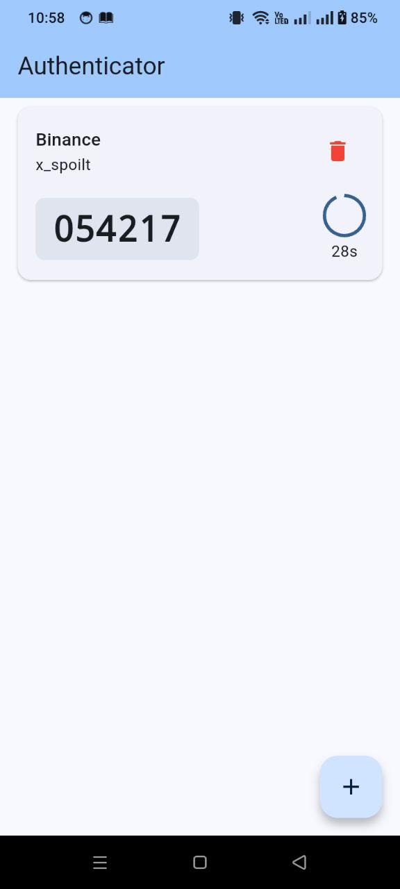
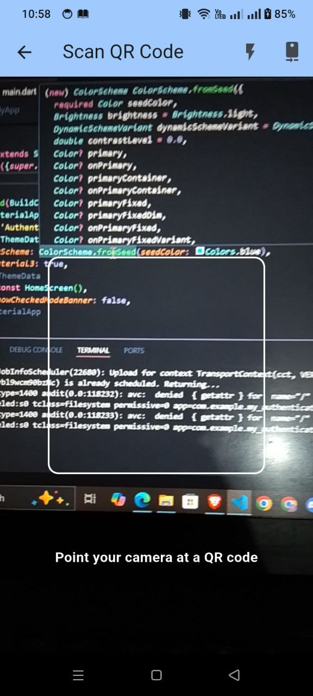

# 🔐 Authenticator - 2FA Key Generator


**Authenticator** is an open-source 2FA (Two-Factor Authentication) key generator app built using **Flutter**. It supports the Time-Based One-Time Password (TOTP) standard and is designed to help you securely manage your 2FA tokens for various services.

---

## 🚀 Features

- ✅ Generate TOTP-based 2FA tokens
- 🔐 Securely store and view 2FA keys
- 📸 QR code scanning
- 🧑‍💻 100% open-source and self-hostable

---

## 📦 Download

📥 [Download Authenticator v1.0.0](https://github.com/xspoilt-dev/authenticator/releases/tag/v1.0.0)

Visit the [Releases](https://github.com/xspoilt-dev/authenticator/releases) page for the latest builds and updates.

---

## 🛠️ Installation

### Android (APK)
1. Download the `.apk` file from the [release page](https://github.com/xspoilt-dev/authenticator/releases/tag/v1.0.0)
2. Install it on your Android device
3. Start securing your accounts!

### Flutter (Build Manually)
If you want to build the app yourself:

```bash
git clone https://github.com/xspoilt-dev/authenticator.git
cd authenticator
flutter pub get
flutter run
````

---

## 🖼️ Screenshots

<p float="left">    </p>

---

## 🔧 Tech Stack

* Flutter
* Dart
* TOTP Algorithm
* Local Storage

---


## 🧑‍💻 Contribution

Contributions are welcome! Feel free to fork this repository, submit a pull request, or open an issue for any bugs or feature requests.

---

## 📄 License

This project is licensed under the [MIT License](LICENSE).

---

## 📬 Contact

For suggestions, bugs, or feedback, feel free to reach out or open an [issue](https://github.com/xspoilt-dev/authenticator/issues).

---

Made with ❤️ by [xspoilt-dev](https://github.com/xspoilt-dev)

